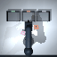
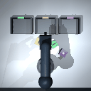
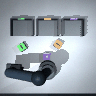

# PickSort-VLA

[](https://github.com/1830051801-ux/picksort-vla/actions/workflows/ci.yml)
[](https://www.python.org/)
[](LICENSE)

PickSort-VLA is a compact MuJoCo/Gymnasium project for language-conditioned
quality sorting. It supports a five-axis legacy interface and an optional
six-axis desktop-arm variant that sorts `accepted`, `scratch`, and `unknown`
parts from natural-language instructions. The repository includes an IK
demonstration expert, behavior cloning, ACT-style action chunks, Temporal VLA,
domain randomization, bounded residual SAC, synthetic RGB-D perception labels,
predictive simulator safety filtering, real-log replay, and a ROS 2 dry-run
bridge.

> This is a **401k-parameter compact VLA**, not a 7B-scale foundation model.
> The committed benchmark is simulation-only. No physical-robot success rate
> is claimed.

The public project name and repository are now **PickSort-VLA**. For v0.x
compatibility, the Python distribution remains `smartpick-vla`, the import is
`smartpick_vla`, and existing ROS/checkpoint identifiers are unchanged. New
installs provide both `picksort` (preferred) and `smartpick` commands.





## Included

- Self-contained MuJoCo arm with a five-axis compatibility mode and an optional
  sixth tool-roll axis, parallel gripper, three movable parts, three labelled
  trays, top/oblique/wrist cameras, collisions, wrong-pick/wrong-bin events,
  and deterministic episode seeds.
- Gymnasium observation contract: `rgb uint8[H,W,3]`, natural-language
  `instruction`, and either `robot_state float32[24]` (five-axis) or
  `robot_state float32[29]` (six-axis).
- Continuous normalized actions: legacy `[dx, dy, dz, dyaw, gripper]` or
  six-axis `[dx, dy, dz, dyaw, droll, gripper]`. Translation and orientation
  deltas are base-frame commands; `-1/+1` closes/opens the gripper.
- Ordered one-to-three-object missions that update the active instruction after
  each correctly sorted part, allowing sequential visual-language control in
  one episode.
- Synthetic multi-view perception generation: RGB, depth, instance masks,
  per-view bounding boxes, robot state, expert action, and language labels.
- Train/held-out paraphrase/OOD instruction templates without template leakage.
- Episode-level camera, lighting, object color, mass, friction, state noise,
  detector noise, and control-delay randomization.
- Privileged closed-loop waypoint expert using damped least-squares Cartesian IK.
- Single-step behavior cloning and an ACT-style action-query Transformer that
  predicts eight continuous actions per observation.
- Temporal VLA with left-padded multi-frame RGB/proprioception context and a
  time-token Transformer before action-query decoding.
- Residual SAC that freezes the VLA and enforces
  `final = clip(base + scale * tanh(residual), -1, 1)`.
- Paired ID, paraphrase, OOD-layout, and physics suites with identical seeds,
  raw episode CSV, Wilson 95% intervals, inference latency, collisions, cycle
  time, action smoothness, residual magnitude, plots, and GIF provenance.
- Optional perception-stress suite with deterministic image noise, partial
  occlusion, and bounded visual latency while mechanics remain nominal.
- Simulator-only predictive action shield that rolls a copied MuJoCo state
  forward, scales unsafe motion, and writes intervention evidence into the
  evaluation metadata.
- Versioned JSONL/CSV real-log import, calibration, replay/resampling, system
  parameter records, and ROS 2 preview/hardware gating.
- Source-traced XiaoU six-axis hardware baseline covering CAD dimensions,
  joint limits, Pi-F407 UART, F407-CAN, synchronized 26-byte trajectories, and
  explicit readiness gates; profile inspection never opens hardware transport.
- XiaoU camera-homography and grasp-profile adapter that emits an auditable
  six-axis `pregrasp → grasp → lift` planning preview; it has no CAN, serial,
  or hardware-execution path.
- Windows/Linux commands, unit/integration tests, CI, build verification, MIT
  license, data/model cards, and a release checker.

## Measured smoke benchmark

The smoke tier checks that the full pipeline runs; it is not a statistically
powered benchmark. It uses one training seed, six paired episodes per suite,
and a configurable contact-proximity grasp latch. Counts and intervals are
derived from `results/smoke/eval_episodes.csv`.

| Method | ID | Paraphrase | OOD layout | Physics | Overall success (Wilson 95%) | Collision episodes | Mean successful sim cycle |
|---|---:|---:|---:|---:|---:|---:|---:|
| Privileged IK expert | 6/6 | 6/6 | 6/6 | 6/6 | 24/24, 100% `[86.2, 100]` | 4/24 | 3.22 s |
| BC | 0/6 | 0/6 | 0/6 | 0/6 | 0/24, 0% `[0, 13.8]` | 24/24 | — |
| Compact VLA | 0/6 | 0/6 | 0/6 | 1/6 | 1/24, 4.2% `[0.7, 20.2]` | 21/24 | 5.20 s |
| VLA + DR | 1/6 | 0/6 | 0/6 | 1/6 | 2/24, 8.3% `[2.3, 25.8]` | 20/24 | 3.16 s |
| VLA + DR + residual SAC | 1/6 | 0/6 | 1/6 | 0/6 | 2/24, 8.3% `[2.3, 25.8]` | 23/24 | 2.78 s |

At this training budget, the learned policies remain far behind the privileged
expert. DR raised success from 1/24 to 2/24. Residual SAC moved one success from
the physics suite to OOD, did not change the 2/24 total, and increased collision
episodes. It is a negative/neutral result.

Training evidence for this run:

| Artifact | Actual local run |
|---|---:|
| Nominal IK demonstrations | 72/72 successful, 5,593 transitions |
| DR IK demonstrations | 72/72 successful, 5,849 transitions |
| BC | 111,013 parameters, 432 optimizer updates |
| Compact VLA | 401,429 parameters, 672 optimizer updates |
| VLA + DR | 401,429 parameters, 392 DR fine-tuning updates |
| Residual SAC | 1,800 environment steps, 1,600 gradient updates, 0/10 training episodes successful |

Runtime versions, configs, and artifact hashes are recorded in
`results/smoke/run_manifest.json`. This run used Python 3.13 and CPU PyTorch.
The committed table predates the six-axis scene revision and remains historical
pipeline evidence rather than a claim of bit-identical reproduction on the
current scene. New six-axis artifacts record their own scene hashes and configs.

## Six-axis and mission upgrade

The current upgrade adds a six-axis control variant, multi-view synthetic
perception labels, ordered multi-object missions, and a copied-state predictive
safety shield. These are runnable simulator features, not claims of physical
robot transfer or industrial inspection accuracy.

| Local artifact | Actual recorded smoke result | Scope |
|---|---:|---|
| `perception_multiview_smoke.npz` | 9 labelled RGB-D/mask/bbox samples | Synthetic export-contract check |
| `mission_six_axis_expert_smoke` | 6/6 three-subtask missions | Privileged IK expert with grasp assist |
| `safety_six_axis_smoke` | 8/8 single-subtask episodes | Filter enabled; no nominal expert intervention needed |

Use `configs/data/perception_multiview_smoke.yaml`,
`configs/eval/mission_six_axis_expert_smoke.yaml`, and
`configs/eval/safety_six_axis_smoke.yaml` to reproduce the artifacts. The
six-axis mission showcase above uses the privileged expert, not a learned
policy. The full data schema, safety behavior, recorded commands, and current
limitations are in [Embodied simulation upgrade](docs/EMBODIED_SIMULATION_UPGRADE.md).

## Verified six-axis vision loop

The release path exercises a separate RGB-guided controller on the six-axis
scene. It fits a simulated nine-point top-camera homography, parses the active
language instruction into one of three task classes, localizes the target
grasp keypoint with a compact spatial heatmap model, and emits bounded Cartesian
translation plus wrist-roll actions. A copied-state MuJoCo safety filter checks
candidate motion before each environment step.

The arm home keyframe is deliberately camera-clear. A reset-pose regression
case covers the earlier seed-909 self-occlusion failure, and the release data
and checkpoint were regenerated after the pose change.



The following is a recorded local simulation run, not a hardware result:

| Artifact | Recorded value |
|---|---:|
| Dataset | `datasets/generated/vision_six_axis_release_v2.npz` (3,600 RGB frames) |
| Checkpoint | `checkpoints/vision_six_axis_release_v2/best.pt` (305,702 parameters) |
| Validation localization error | 1.606 px (episode-disjoint split) |
| Evaluation seeds | 901-915 (15 episodes, paraphrase + OOD layout) |
| Success / collision episodes | 15/15 (100%) / 0/15 |
| Mean / P95 localization error | 12.21 mm / 18.22 mm |
| Mean perception-to-action latency | 4.28 ms |
| Task-selection accuracy | 100% |

`grasp_assist=true` was enabled in this run. Scene poses were used only by the
evaluator after action selection, and `physical_hardware_execution=false` is
recorded in `results/vision_guided_six_axis_release_v2/summary.json`. Reproduce
the run with:

```powershell
$py = ".\.venv\Scripts\python.exe"

& $py -m smartpick_vla generate-perception `
  --config configs/data/vision_six_axis.yaml `
  --output datasets/generated/vision_six_axis_release_v2.npz

& $py -m smartpick_vla train-vision `
  --config configs/train/vision_localizer_six_axis.yaml `
  --dataset datasets/generated/vision_six_axis_release_v2.npz `
  --output checkpoints/vision_six_axis_release_v2

& $py -m smartpick_vla evaluate-vision `
  --config configs/eval/vision_guided_six_axis.yaml `
  --checkpoint checkpoints/vision_six_axis_release_v2/best.pt `
  --output results/vision_guided_six_axis_release_v2
```

## Quick start

Python 3.11–3.13 is supported by project metadata and CI. The recorded local run
used Python 3.13 on Windows 11.

### Windows PowerShell

```powershell
py -3.13 -m venv .venv
.\.venv\Scripts\python.exe -m pip install -U pip
.\.venv\Scripts\python.exe -m pip install -e ".[dev]"
.\.venv\Scripts\python.exe -m smartpick_vla doctor
.\.venv\Scripts\python.exe -m pytest -q
.\.venv\Scripts\python.exe -m smartpick_vla demo-expert `
  --seed 11 --task-class scratch `
  --output results/quickstart/expert.gif
```

Or run the short wrapper:

```powershell
.\scripts\quickstart.ps1
```

### Linux

```bash
python3 -m venv .venv
.venv/bin/python -m pip install -U pip
.venv/bin/python -m pip install -e '.[dev]'
.venv/bin/python -m smartpick_vla doctor
.venv/bin/python -m pytest -q
MUJOCO_GL=egl .venv/bin/python -m smartpick_vla demo-expert \
  --seed 11 --task-class scratch \
  --output results/quickstart/expert.gif
```

MuJoCo Linux CI installs Mesa and runs the rendering tests headlessly. GitHub's
Windows runners have no usable OpenGL context, so they run the platform-safe
suite; the recorded local Windows run covers native MuJoCo/GLFW rendering.
Paths are handled with `pathlib`, including Windows profiles with non-ASCII text.

PyTorch wheels contain very deep third-party license paths. If `pip` raises
`WinError 206` in a deeply nested checkout, create the virtual environment at a
short location (for example `C:\spvla_wv`) or enable Windows long paths. The
release wheel was independently installed and its MuJoCo doctor passed from the
short-path environment; this does not affect repository path handling.

## Reproduce the complete smoke run

The following script regenerates demonstrations, trains all learned methods,
runs the paired suites, produces plots/GIFs, and executes the release checker.
It stays out of CI because it performs real training.

```powershell
.\scripts\run_smoke.ps1
```

Linux:

```bash
bash scripts/run_smoke.sh
```

The equivalent commands are explicit and independently runnable:

```powershell
$py = ".\.venv\Scripts\python.exe"

& $py -m smartpick_vla generate `
  --config configs/train/data_smoke.yaml `
  --output datasets/generated/smoke/expert_nominal.npz

& $py -m smartpick_vla train `
  --config configs/train/bc_smoke.yaml `
  --dataset datasets/generated/smoke/expert_nominal.npz `
  --output checkpoints/smoke/bc

& $py -m smartpick_vla train `
  --config configs/train/vla_smoke.yaml `
  --dataset datasets/generated/smoke/expert_nominal.npz `
  --output checkpoints/smoke/vla

& $py -m smartpick_vla train-residual `
  --config configs/train/residual_smoke.yaml `
  --base-checkpoint checkpoints/smoke/vla_dr/best.pt `
  --output checkpoints/smoke/residual
```

`configs/train/long.yaml` is a larger suggested budget. It is not represented as
already executed and its numbers never appear in the measured smoke table.

## Task and environment

Each reset places one object from every quality class at non-overlapping random
positions. The instruction selects the target class, for example:

- `place the accepted part in the accepted tray`
- `route the cosmetically damaged piece to the blemish container`
- `send the indeterminate unit for human inspection`

Success requires the requested object to be released and stable inside its
matching tray. Placing it in another tray terminates as `wrong_bin`; contacting
or grasping a non-target object is tracked separately. `cycle_time_s` is
simulation control time, not a physical production-cycle measurement.

Set `mission_length` to 2 or 3 to sort multiple unique classes in order. A
correct place event changes the instruction to the next target while keeping
the prior part in its tray. Mission success requires all requested subtasks;
the one-object behavior remains the default.

Actions are normalized. At the environment boundary they map to a maximum
25 mm Cartesian translation and 0.10 rad yaw/roll change per 40 ms control
step. Cartesian deltas use `base_link`, metres, and radians. The legacy mode
has five action elements; `six_axis=true` adds `droll` and uses 29D state.

### Grasp-assist disclosure

Smoke configs use a proximity-gated MuJoCo weld when a closing gripper is close
to an object. The arm, object motion, collisions, transfer, release, gravity,
and tray placement still run in MuJoCo, but this is not a pure contact-physics
grasp. Every episode records `grasp_assist=true`; reports must retain it. The
option can be disabled for contact tuning, but no unassisted benchmark is
claimed here.

## Models

### IK expert

The expert reads privileged target poses and follows
`pregrasp → descend → close → lift → transfer → lower → release → retreat`.
It emits the active five- or six-dimensional normalized action convention. It
is a data source and upper bound, not a deployable visual policy.

### Behavior cloning

The BC baseline uses the compact CNN, UTF-8 byte language encoder, robot-state
MLP, and a single-action head. It intentionally exposes closed-loop compounding
error rather than receiving privileged coordinates.

### Compact VLA / ACT-style action chunking

The policy uses a lightweight CoordConv CNN, byte-level Transformer language
encoder, robot-state token, learned action queries, and a two-layer Transformer
decoder. It returns `[batch, horizon=8, action=5]`; inference executes a
receding-horizon prefix and replans. It has 401,429 trainable parameters in the
smoke config and is trained from scratch on project demonstrations.

The term “ACT-style” refers to action queries and chunked continuous prediction.
This implementation does not claim to reproduce ACT's CVAE or published results.

### Temporal VLA / history-aware action chunking

`TemporalVLAPolicy` retains a fixed-length, episode-safe history of RGB frames
and matching 24D or 29D robot states. Each history step is encoded into visual and
proprioceptive tokens, then a temporal Transformer fuses that context before
the language-conditioned action-query decoder emits its action chunk. It is a
compact local model, not a pretrained VLA foundation model.

The included `configs/train/temporal_vla_smoke.yaml` is a reproducible training
configuration. It is not represented as a completed benchmark result until a
separate run manifest, checkpoint, and paired evaluation are committed.

### Domain randomization

`VLA + DR` has the same architecture and fine-tunes the nominal VLA checkpoint
on episodes with actual model/camera/controller perturbations. The physics suite is
stronger than training DR and is kept separate from the OOD-layout and
paraphrase suites.

### Bounded residual SAC

Residual SAC never learns the task from scratch. The base VLA is frozen, replay
stores compact `[robot_state, base_action]` features rather than RGB, and the
actor can only make the configured correction. With the default normalized
scale, translation correction is at most roughly 5 mm per step. The composed
action is checked again by the real-system safety supervisor before any ROS 2
route is considered.

## Evaluation contract

| Suite | Language | Layout | Physics | Camera stream |
|---|---|---|---|---|
| `id` | training templates | ID range | nominal | nominal |
| `paraphrase` | held-out rewrites | ID range | nominal | nominal |
| `ood` | training templates | wider unseen range | nominal | nominal |
| `physics` | training templates | ID range | stronger perturbations | declared DR |
| `perception` | training templates | ID range | nominal | noise, occlusion, latency |

Every method receives the same ordered `(suite, seed)` manifest. The runner
rejects a comparison if task class, instruction template, or randomization
draw differs between paired methods. See
[`docs/EXPERIMENT_PROTOCOL.md`](docs/EXPERIMENT_PROTOCOL.md) for exact metrics,
Wilson intervals, failure accounting, and tier definitions.

## Real2Sim2Real scope

The implemented scope is **real-log replay / Sim2Real preparation**:

- strict JSONL/CSV contracts with schema, timestamp, frame, units, image path,
  robot state, instruction, action, and outcome;
- calibrated camera-frame to `base_link` transformation;
- Kabsch rigid-transform estimation with RMSE/max-error reporting;
- deterministic replay and optional fixed-rate resampling;
- explicit mass, friction, damping/gain scale, latency, detector noise, and
  camera uncertainty parameters;
- dry-run action audit and ROS 2 typed messages.

It does not automatically infer a digital twin from a log, certify collision
safety, or establish a real grasp rate. Start with:

```powershell
.\.venv\Scripts\python.exe -m smartpick_vla real-validate `
  --config configs/real/default.yaml `
  --log examples/real_logs/example_episode.jsonl

.\.venv\Scripts\python.exe -m smartpick_vla real-replay `
  --config configs/real/default.yaml `
  --log examples/real_logs/example_episode.jsonl `
  --resample
```

Full details: [`docs/REAL2SIM2REAL.md`](docs/REAL2SIM2REAL.md).

### XiaoU six-axis planning preview

For the XiaoU desktop-arm workflow, the adapter consumes a pixel-to-`base_link`
homography plus complete per-object vertical grasp profiles. It exports three
ROS 2-compatible `PoseStamped` previews in the order `pregrasp → grasp → lift`.
The command below uses synthetic simulation-only profiles and never commands
hardware:

```powershell
.\.venv\Scripts\python.exe -m smartpick_vla xiaou-preview `
  --homography configs/real/xiaou_demo_homography.yaml `
  --profiles configs/real/xiaou_simulated_profiles.yaml `
  --label cola --u-px 1030 --v-px 490 `
  --output results/examples/xiaou_plan_preview.json
```

Actual XiaoU profiles with unknown heights are rejected deliberately. See
[`docs/XIAOU_BRIDGE.md`](docs/XIAOU_BRIDGE.md).

To inspect the supplied XiaoU technical baseline without opening serial, CAN,
ROS, or a motor channel:

```powershell
.\.venv\Scripts\python.exe -m smartpick_vla xiaou-hardware-profile
```

The profile records six-axis geometry and the Pi/F407/CAN interface contract,
but keeps `real_motion_ready: false`, `hardware_execution_enabled: false`, and
`moveit_mode: review_only`. It does not contain guessed CAN IDs or unmeasured
camera/TCP/grasp values. See
[`docs/XIAOU_TECHNICAL_BASELINE.md`](docs/XIAOU_TECHNICAL_BASELINE.md).

## ROS 2 dry-run boundary

The optional package is in `ros2_ws/src/smartpick_vla_ros2`. Its default is
`dry_run=true`, `hardware_enabled=false`. Dry-run publishes previews/status and
audit JSONL; it does not publish the hardware command topic. Hardware routing
requires both software gates plus a fresh state, controller-ready signal,
heartbeat, and released emergency stop.

Safety validation occurs after base and residual composition. It checks finite
values, timestamp freshness, frame, horizon/dt, translation/yaw rate, predicted
workspace, gripper range, configured joint limits, and residual bounds. This is
defence in depth, not a safety-certified controller.

The pure Python conversion/safety core is locally tested without ROS. This
workstation did not have ROS 2/`colcon`, so an actual ROS workspace build is not
claimed. See [`docs/ROS2_DRY_RUN.md`](docs/ROS2_DRY_RUN.md).

## Repository layout

```text
configs/                         environment, training, evaluation, real cell
docs/                            architecture, protocols, cards, limitations
examples/real_logs/              synthetic schema example (clearly labelled)
ros2_ws/src/smartpick_vla_ros2/  optional ROS 2 interfaces and safety bridge
scripts/                         smoke, quickstart, release/provenance checks
src/smartpick_vla/
  data/                          expert collection and episode-safe chunks
  envs/                          MuJoCo/Gymnasium task and camera stress
  evaluation/                    paired suites, metrics, plots, GIF evidence
  models/                        BC, Compact VLA, Temporal VLA, residual RL
  real/                          logs, calibration, XiaoU baseline/preview, safety
  training/                      supervised and residual-SAC loops/checkpoints
tests/                            unit and MuJoCo integration tests
```

## Verification and release

```powershell
.\.venv\Scripts\python.exe -m ruff check .
.\.venv\Scripts\python.exe -m ruff format --check .
.\.venv\Scripts\python.exe -m mypy src/smartpick_vla
.\.venv\Scripts\python.exe -m bandit -r src scripts ros2_ws -q -ll -ii
.\.venv\Scripts\python.exe -m pip_audit --local --skip-editable
.\.venv\Scripts\python.exe -m pytest -q
.\.venv\Scripts\python.exe -m pip check
.\.venv\Scripts\python.exe scripts/check_release.py --strict
.\.venv\Scripts\python.exe -m build
```

CI covers Windows and Ubuntu across Python 3.11, 3.12, and 3.13. Full training
stays out of CI. Linux runs the rendering tests; Windows covers models,
checkpoints, logs, safety, metrics, and the benchmark runner. See
[`docs/RELEASE.md`](docs/RELEASE.md).

## Known limitations

- Simulation uses a self-contained primitive arm with a five-axis legacy mode
  and optional sixth tool-roll axis, not a calibrated production robot model.
- The XiaoU bridge produces planning-only targets. It does not prove a six-axis
  MoveIt build, measured grasp profile, CAN protocol, or physical execution.
- The smoke dataset is small and one-seed results have wide uncertainty.
- Category appearance is visible by design; texture/shape diversity remains limited.
- Byte-level language is lightweight and trained locally, not a pretrained LLM.
- Contact-assisted grasping and simulation collision checks are not hardware
  safety evidence.
- The verified vision result is a one-object-per-episode six-axis simulation
  suite; the separate three-object mission result remains a privileged IK
  upper bound, not a learned multi-mission result.
- ROS 2 package compilation and physical execution require an external ROS/cell
  installation and have not been claimed from this Windows run.

The complete list is in [`docs/LIMITATIONS.md`](docs/LIMITATIONS.md).

## Documentation

- [`docs/ARCHITECTURE.md`](docs/ARCHITECTURE.md)
- [`docs/EMBODIED_SIMULATION_UPGRADE.md`](docs/EMBODIED_SIMULATION_UPGRADE.md)
- [`docs/EXPERIMENT_PROTOCOL.md`](docs/EXPERIMENT_PROTOCOL.md)
- [`docs/REPRODUCIBILITY.md`](docs/REPRODUCIBILITY.md)
- [`docs/DATA_CARD.md`](docs/DATA_CARD.md)
- [`docs/MODEL_CARD.md`](docs/MODEL_CARD.md)
- [`docs/REAL2SIM2REAL.md`](docs/REAL2SIM2REAL.md)
- [`docs/XIAOU_BRIDGE.md`](docs/XIAOU_BRIDGE.md)
- [`docs/XIAOU_TECHNICAL_BASELINE.md`](docs/XIAOU_TECHNICAL_BASELINE.md)
- [`docs/ROS2_DRY_RUN.md`](docs/ROS2_DRY_RUN.md)
- [`docs/RELEASE.md`](docs/RELEASE.md)

## Contributing and security

See [`CONTRIBUTING.md`](CONTRIBUTING.md) before opening a change. Safety or
hardware-control issues should follow [`SECURITY.md`](SECURITY.md), not a public
trial-and-error deployment.

## License and citation

MIT License. See [`LICENSE`](LICENSE) and [`THIRD_PARTY_NOTICES.md`](THIRD_PARTY_NOTICES.md).
Citation metadata is provided in [`CITATION.cff`](CITATION.cff).
