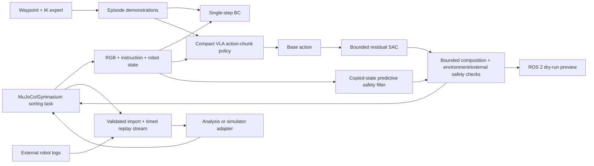

# Architecture

## Scope and design constraints

PickSort-VLA studies a narrow but complete manipulation loop: observe a
tabletop sorting cell, interpret a natural-language quality instruction, and
produce continuous robot actions. It intentionally targets a Windows laptop
with an RTX 3050-class 4 GB GPU and 16 GB RAM.

The implementation is compact:

- The visual encoder is a small trainable CNN, not a frozen internet-scale
  vision foundation model.
- The language encoder is a learned UTF-8 byte Transformer, not an LLM.
- The action decoder follows ACT's action-query/chunking idea, but it is not a
  reproduction of the full ACT CVAE.
- Residual SAC corrects a frozen imitation policy within explicit bounds; it
  does not learn grasping from an uninitialized policy.
- Real-log replay and ROS 2 dry-run prepare a transfer boundary. They do not
  establish real-robot success.

## System flow



## Task and simulation

The default interface uses a primitive five-axis arm contract, a parallel
gripper, three workpieces, and three destination trays. An optional sixth
tool-roll joint exposes a six-axis simulator contract without breaking legacy
five-axis data. The quality classes are:

| Class | Intended destination | Task meaning |
| --- | --- | --- |
| `accepted` | accepted tray | part judged conforming |
| `scratch` | scratch/rework tray | visible surface defect |
| `unknown` | inspection tray | decision deferred for manual inspection |

Each default episode chooses one target class and samples an instruction from a
named split. `mission_length=2` or `3` selects a duplicate-free ordered class
sequence; correct placement switches the active instruction to the next class
while keeping prior parts in their trays. The train, paraphrase, and OOD
template sets are disjoint. Object pose,
mass, friction, camera pose/FOV, illumination, color nuisance, robot-state
noise, detection-coordinate noise, and control delay can be randomized. The
exact sampled values must be recorded in episode metadata.

The scene includes opt-in equality constraints that stabilize a grasp after
the environment's grasp preconditions are met. Results produced with this
contact-gated grasp assist must retain that setting in their configuration;
they must not be described as an unassisted contact-physics benchmark.

### Camera-clear six-axis reset

The six-axis home keyframe is selected jointly with the top-camera viewpoint,
not only for a visually convenient arm pose. A deterministic pose sweep checks
initial target visibility, fixed-geometry contacts, and IK reachability over the
release seed set. The release keyframe is
`[1.5, -0.2, -1.8, -1.142, 0, 0]` radians for the six arm joints. It removes a
known self-occlusion case in which the original home pose covered the target
on seed 909. The regression test keeps this failure from silently returning.

### Verified RGB-to-action path

The release vision controller is intentionally decomposed into auditable
stages:

```text
RGB frame
  -> spatial heatmap localizer (class-conditioned grasp keypoints)
  -> three-frame consistency gate
  -> simulated nine-point homography (pixel -> base XY)
  -> language task parser (accepted/scratch/unknown)
  -> six-axis waypoint controller and damped IK
  -> copied-state predictive safety filter
  -> MuJoCo action step and evaluator metrics
```

The learned localizer consumes RGB only. Robot state, instruction, and the
saved calibration are controller inputs; privileged object poses are withheld
until the evaluator computes post-action error and success metrics. The
`vision_six_axis_release_v2` checkpoint and its episode CSV are the current
release evidence for this path.

## Observation contract

The learning policies consume three modalities:

1. `rgb`: a fixed top camera image, stored as `uint8` and normalized inside the
   model.
2. `instruction`: the unmodified natural-language command. Text is encoded as
   UTF-8 bytes so the smoke path has no external tokenizer or model download.
3. `robot_state`: a fixed-length `float32` vector containing joint position and
   velocity, TCP position/yaw encoding, gripper state, and the previous action.
   The environment exposes this raw vector; any training-time normalization is
   explicit preprocessing whose statistics belong in dataset/checkpoint
   metadata.

Privileged MuJoCo object and bin poses are available to the expert, reward, and
metric code only. They must not be added to learned-policy inputs without
declaring a distinct oracle ablation.

`TemporalVLAPolicy` receives an additional episode-safe history view:
`rgb_history [T,3,H,W]`, `robot_state_history [T,24 or 29]`, and boolean
`history_mask [T]`. Missing oldest observations are zero-padded and masked, so
a temporal window cannot leak frames from a previous episode.

The perception-data generator is intentionally separate from the policy
observation contract. It can render top, oblique, and wrist RGB-D views with
MuJoCo instance masks, visible-pixel counts, and boxes. Those labels support
detector/segmentation work and regression tests; they are not privileged inputs
to the VLA policies.

## Action contract

The legacy canonical action has five ordered elements:

```text
[dx, dy, dz, dyaw, gripper]
```

- Cartesian deltas are expressed in `base_link`.
- Logs and ROS messages use metres and radians.
- The policy emits normalized values in `[-1, 1]`; the environment converts
  them with configured per-step translation and yaw limits.
- `gripper` is normalized to `[-1, 1]`, with the sign/open-close convention
  carried in schema metadata.
- With `six_axis=true`, the simulator action is
  `[dx, dy, dz, dyaw, droll, gripper]`, state is 29D, and action chunks have
  shape `[H, 6]`. It is a separate checkpoint/data contract.
- A legacy action chunk has shape `[H, 5]`. `H=8` is the current Compact VLA default,
  but the horizon is checkpoint metadata rather than a wire-format constant.

The base policy and residual policy use the same order. Simulation composition
happens in normalized policy space and clips to the environment action range.
External physical-unit chunks instead pass through `SafetySupervisor`, which
bounds the requested residual and rejects an unsafe final chunk rather than
silently projecting it. Real-log ingestion rejects non-finite values, the wrong
frame, and the wrong action dimension.

### Predictive simulator safety filter

For simulation-only studies, `PredictiveSafetyFilter` copies the current
MuJoCo state, applies the environment's IK-derived position targets, and rolls
the candidate action forward for a bounded number of control steps. It accepts
full motion when no collision is predicted, otherwise tries geometrically
smaller Cartesian/orientation deltas before emitting a no-motion fallback.
The evaluation runner records its configuration and intervention report in
episode metadata. This filter has no hardware transport and is not a safety
certification. Its optional finger-to-table allowance exists only because the
primitive contact-assisted grasp model can brush the tabletop during a nominal
downward approach.

## IK expert and low-level control

The expert is a privileged waypoint state machine:

```text
environment home reset -> pre-grasp -> descend -> close -> lift -> transfer -> lower -> release -> retreat
```

For every Cartesian target, damped least-squares IK in the environment uses the
MuJoCo site Jacobian, clips each iterative update, and clamps commanded joint
targets to model limits.
The expert emits the active five- or six-dimensional task-space action used by
learned policies. It resets its waypoint state when a multi-object mission
switches tasks. This makes expert, BC, and Compact VLA rollouts comparable at
the environment boundary.

The expert is an upper-bound controller with privileged geometry, not a fair
vision-only policy. Report it separately and retain unsuccessful demonstration
attempts in generation statistics even if only successful episodes are used
for imitation learning.

## Behavior cloning baseline

The BC policy independently encodes RGB, instruction, and robot state, pools
the visual and language tokens, and predicts one normalized action. Its purpose
is to isolate the value of action chunking; it is not intentionally weakened by
removing an input modality.

Default architectural scale:

- compact CoordConv visual grid encoder;
- one-layer byte-language Transformer;
- robot-state MLP;
- fused MLP action head with `tanh` output.

All parameter counts in reports must come from the instantiated checkpoint,
not an estimate in documentation.

## Compact VLA and ACT-style action chunks

The Compact VLA projects an RGB feature grid, byte-language sequence, and one
robot-state token into a common width. Learned action queries attend to this
memory through a small Transformer decoder and predict the complete action
chunk in parallel.

The default configuration uses `d_model=128`, four attention heads, two decoder
layers, and horizon eight. These defaults are sized for local training, not for
comparison with billion-parameter VLA foundation models. Optional encoder
freezing is supported, but a result must state which components were frozen.

Training applies a padded future-action mask so samples near an episode boundary
do not learn artificial zero actions. Inference executes the first action (or a
documented short prefix) and replans. If temporal ensembling is enabled, its
weighting and execution stride become part of the evaluation configuration.

### Temporal VLA

The temporal policy shares compact vision and UTF-8 language encoders with the
single-frame model. It mean-pools each visual grid into one timestep token,
adds a robot-state token and learned time embedding, then uses a Transformer
encoder over the observation window. The action-query decoder attends to these
temporal tokens plus current-language tokens. Evaluation preserves this history
inside one episode and clears it at every reset.

## Bounded residual SAC

The base Compact VLA is frozen during residual training. The implemented SAC
observation is the 24-value robot state concatenated with the five-value base
action. Image frames and VLA latent features are not duplicated in replay.

For normalized actions:

```text
r_t          = tanh(actor(s_t))
a_final_norm = clip(a_base + residual_scale * r_t, -1, 1)
a_sim        = environment_step(a_final_norm)
```

`residual_scale` is a per-dimension vector. Translation, yaw, and gripper
corrections therefore have independent hard bounds. The reward can include
task progress, success, wrong-bin, collision, timeout, and residual-norm terms;
reward weights must live in the run configuration.

At a physical-unit/ROS boundary, the equivalent composed chunk is accepted only
if the separate safety inspector passes its frame, timing, rate, workspace,
joint-state, and gripper checks. That software gate is not a physical safety
certification.

Residual training is not counted as successful merely because its training
return rises. The frozen base checkpoint and the composed policy must be
evaluated on identical seeds, and degradation must be reported.

## Data boundaries

Simulation demonstrations and imported real logs share versioned episode and
step records. An episode identifies its source as `sim`, `real`, or
`real_replay`; source values must never be rewritten during conversion.

Training splits are assigned by episode before action windows are constructed.
Frames or overlapping chunks from one episode cannot appear in multiple
splits. See the [data card](DATA_CARD.md) and
[experiment protocol](EXPERIMENT_PROTOCOL.md).

## Real2Sim2Real and ROS 2

Real-log import validates schema, coordinates, units, and timing. The replay
primitive can preserve source timing or resample feedback while holding
discrete commands. Applying those frames to MuJoCo is an explicit adapter or
experiment callback; the core replay class does not infer missing scene state
or claim a calibrated digital twin. It supports system-parameter and domain-
randomization studies, but does not prove transfer.

The ROS 2 package receives base and residual action chunks, composes them, runs
the same safety checks, and publishes preview/status messages. Its default is
`dry_run=true` and `hardware_enabled=false`. The core Python package does not
silently publish to a motor-controller topic. See [ROS 2 dry-run](ROS2_DRY_RUN.md).

## Reproducibility and resource envelope

- Seed Python, NumPy, PyTorch, Gymnasium, and environment reset separately from
  a single recorded run seed.
- Record the MuJoCo version because physics can change between versions.
- Keep evaluation episode lists fixed and committed as configuration.
- Prefer 64-96 px observations, small batches, mixed precision where verified,
  and zero DataLoader workers on Windows smoke runs.
- Do not load the full image dataset into RAM or store image tensors in the SAC
  replay buffer.
- Renderer output may differ across drivers; physics metrics should not depend
  on pixel-perfect screenshots.

## Package boundaries

The package is divided by responsibility rather than by experiment:

| Area | Responsibility |
| --- | --- |
| `envs` | MuJoCo scene, Gymnasium API, tasks, randomization |
| `data` | trajectory schema, privileged waypoint expert, collection, action-chunk datasets |
| `models` | encoders, BC, Compact VLA action decoder |
| `training` | supervised steps, checkpoints, and residual SAC |
| `evaluation` | controllers, episode metrics, machine-readable artifacts, plots, and media |
| `real` | physical-unit contracts, calibration, log replay, safety, and execution gates |
| `utils` | configuration, atomic output, and seed helpers |
| `cli.py` | user-facing data generation, training, demos, diagnostics, and real-log commands |
| `ros2_ws/.../smartpick_vla_ros2` | typed ROS 2 bridge around the ROS-independent safety core |

Consumers should depend on these contracts rather than MuJoCo array indices or
private model layers. Checkpoints and logs carry a schema version so breaking
changes can be rejected rather than silently misinterpreted.
