# Real2Sim2Real workflow

## What the name means in this project

SmartPick-VLA uses **Real2Sim2Real** for an engineering workflow:

1. ingest and validate logs from a real or external robot stack;
2. replay compatible states/actions as a deterministic, optionally resampled
   stream and feed explicit analysis/simulator adapters;
3. measure mismatch and configure plausible system parameters;
4. train/evaluate with domain randomization around those parameters;
5. preview the resulting policy through a ROS 2 dry-run boundary.

The workflow is a transfer-preparation platform. Real-log replay is not a
real-robot policy rollout, and a ROS action preview is not hardware execution.
The initial release has no verified real-robot success rate.

## Data flow

```mermaid
flowchart LR
    A["External robot log"] --> B["Schema, time, unit, and frame validation"]
    B --> C["Calibration transform"]
    C --> D["Deterministic or fixed-rate replay stream"]
    D --> E["Trajectory and event mismatch report"]
    E --> F["System-parameter configuration"]
    F --> G["Domain-randomized training/evaluation"]
    G --> H["ROS 2 dry-run action preview"]
    H --> I["Independent hardware validation (not provided)"]
```



Python interfaces live under `smartpick_vla.real`:

- `types`: versioned real-log and action contracts;
- `safety`: frame, finite-value, range, and workspace checks;
- `execution`: dry-run action composition/preview;
- `calibration`: explicit coordinate conversions;
- `logs`: `load_real_log()` validation and parsing;
- `replay`: `RealLogReplay` for deterministic/timed callbacks and fixed-rate
  resampling. A callback must explicitly apply frames to a simulator or metric
  implementation.

The example under `examples/real_logs/example_episode.jsonl` is a format sample.
Unless its provenance explicitly says otherwise, treat it as synthetic—not as
evidence of a hardware experiment.

## Canonical coordinate and action contract

The canonical frame is `base_link`. Translation uses metres, yaw uses radians,
and time uses monotonic seconds. An action row is ordered:

```text
[dx_m, dy_m, dz_m, dyaw_rad, gripper]
```

`gripper` is normalized to `[-1,1]`; its sign convention is recorded in log
metadata. An action chunk has shape `[H,5]`. Converters must declare their input
frame, units, quaternion convention if used, and calibration identifier. The
loader rejects an undeclared frame or unit instead of guessing.

If a source records camera-frame or tool-frame deltas, transform both position
and orientation through the identified rigid transform before constructing the
canonical action. Do not add a translational offset to a direction vector.

## Real-log content

The current JSONL/CSV loader requires the following per-step contract:

- schema version, episode ID, strictly increasing step index and timestamp;
- instruction and one of the accepted task classes;
- declared translation, rotation, and time units;
- declared action order and coordinate frame;
- TCP state, joint vector, gripper state, and five-dimensional action;
- optional image reference and outcome.

For an auditable external dataset, the surrounding manifest should additionally
contain the following provenance and synchronization information. These fields
are reporting requirements; the current row loader does not invent or enforce
all of them.

An episode needs enough information to establish ordering and interpretation:

- schema version, episode ID, source, robot/cell identifier, and collection
  timestamp;
- instruction, target class, and outcome if known;
- coordinate frames, units, calibration ID, controller rate, and action order;
- monotonic step timestamps;
- robot state and commanded action at each step;
- image references or camera timestamps when vision is analyzed;
- controller state, drops/timeouts, and emergency-stop events when available;
- provenance, consent, and usage/license metadata.

Optional detections should retain bbox convention, image dimensions,
confidence, class mapping, depth/3D method, and source timestamp. Detection
noise in simulation perturbs this declared interface; it does not simulate an
entire perception model.

## Import validation

`load_real_log()` currently fails closed on:

- unknown schema version;
- empty episodes, inconsistent episode IDs, or non-increasing step indices and
  timestamps;
- missing frame/unit metadata;
- non-finite state or action values;
- action vectors other than length five;
- missing image references when images are declared required;
- a calibration transform that is absent, singular, or uses an unknown
  convention.

The row loader validates interpretation and basic numeric integrity. Physical
step, workspace, horizon, freshness, joint, and residual bounds are enforced by
`SafetySupervisor` when records become command chunks. Loader failures include
the input path and line number, but there is not yet a batch warning/rejection
report with accepted counts and input checksum. A publishing pipeline should
add that manifest without weakening fail-closed row validation.

## Time alignment

Robot state, commands, detections, and images often use different clocks or
rates. `resample_episode()` assumes the log has already placed state and command
on one validated timeline. It linearly interpolates TCP/joint feedback, uses
shortest-path yaw interpolation, and zero-order holds actions, gripper state,
and other discrete fields. A conversion from raw asynchronous streams must
record:

- source clock for every stream;
- offset and drift correction, if applied;
- interpolation method and maximum tolerated gap;
- command-to-actuation delay estimate;
- frames rejected because no synchronized state exists.

Never align streams solely by row number. Do not interpolate discrete gripper,
fault, or emergency-stop states as continuous values.

## Calibration

The implemented `CalibrationResult` stores source/target frames, a proper rigid
transform, RMSE, maximum point error, and sample count. A dataset manifest must
add the calibration ID, method, timestamp, units, point-set provenance, and
validity conditions. Reusing a transform after camera, tool, base, table, or
fixture movement is unsupported.

A replay report should include calibration ID and residual statistics. Low
reprojection error is necessary but does not validate joint dynamics, contact,
latency, or gripper geometry.

## Replay modes

The implemented replay primitive emits each validated step to a callback. It
does not sleep unless `realtime=True`; `speed` adjusts relative timing, and an
optional sample period creates a fixed-rate episode. It does not infer initial
object state, drive MuJoCo automatically, or calculate mismatch metrics.

An experiment callback can build one of these modes, which must be explicit:

1. **Command replay** applies recorded action commands to the simulated
   controller from a compatible initial state.
2. **State comparison** compares logged and simulated robot/object trajectories
   at aligned timestamps.
3. **Event replay** compares grasp, release, contact, wrong-bin, and termination
   events where the source log contains them.

The callback, reset state, object placement, task, controller period, latency, and system
parameters are part of replay configuration. If an initial object pose or
controller state is unavailable, report that limitation instead of silently
using a favorable default.

Useful mismatch metrics include joint/EEF RMSE, final-pose error, gripper timing
error, contact/event disagreement, and action saturation. They describe model
fit to a log, not task success of a learned policy on hardware.

## System parameters

The current domain randomizer implements:

- per-object mass scale;
- geom sliding-friction scale;
- camera position and field of view;
- discrete command delay;
- state and detection-coordinate noise;
- light intensity and object-color jitter.

Inertia, contact-solver settings, joint damping/armature, actuator gains, and
other parameters require a future explicit configuration extension; they are
not silently randomized by the current implementation.

The repository exposes configuration and replay primitives; a comparison
callback and report remain experiment-specific. Unless a dedicated
identification algorithm and uncertainty report are present, parameter values
are manually fitted or supplied—not automatically identified. Record the
source, fit logs, objective, bounds, and validation logs for every fitted set.

## Domain-randomization policy

Randomization centers on a named nominal system configuration and samples once
per episode unless otherwise stated. The train distribution, ID evaluation
distribution, and stress/OOD distribution remain separate.

Do not choose ranges after examining final test results without creating a new
experiment version. Excessively broad randomization can make demonstrations
unrealistic or hide model errors; excessively narrow randomization can
overstate transfer preparation. Always preserve the sampled parameters in raw
episode artifacts.

## Recommended transfer sequence

1. Validate the environment, IK expert, and safety limits in simulation.
2. Collect a small passive or controller-log dataset without running the
   learned policy on hardware.
3. Validate schema, clocks, frames, calibration, and action sign conventions.
4. Replay held-out logs and quantify mismatch.
5. Set nominal parameters and defensible randomization ranges.
6. Train BC/Compact VLA and residual policies in simulation.
7. Run the full ID/OOD/paraphrase/perturbation suite.
8. Feed the selected checkpoint through ROS 2 dry-run with recorded robot state.
9. Review previewed actions, saturation, heartbeat, stale-data behavior, and
   workspace rejection logs.
10. Design a separate, supervised hardware commissioning protocol with a
    guarded cell, low speed, hardware limits, emergency stop, and rollback.

Step 10 is outside this repository's verified scope.

## Reporting language

Appropriate:

- “Imported and replayed N external log episodes; source and replay metrics are
  stored in the linked artifacts.”
- “The policy passed the ROS 2 dry-run bounds checks on the recorded stream.”
- “Simulation performance was evaluated under parameters fitted from logs.”

Not appropriate without hardware evidence:

- “The policy succeeds on the real robot.”
- “Real2Sim2Real solved the sim-to-real gap.”
- “The system is safe for deployment.”
